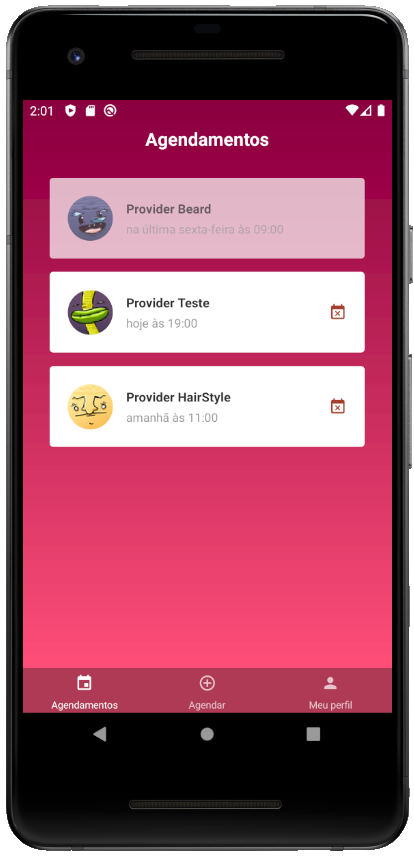
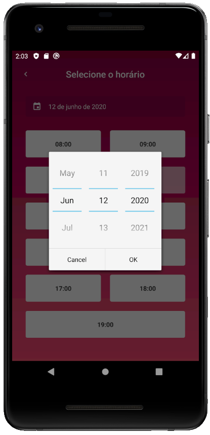

<h1 align="center"> 

</h1>

<h3 align="center">
  O projeto desenvolvido foi uma aplicação completa para uma prestadora de serviços de beleza fictícia, a GoBarber.
</h3>

<p align="center">
  

  

  
</p>

<p align="center">
  <a href="#funcionalidades">Funcionalidades</a>&nbsp;&nbsp;&nbsp;|&nbsp;&nbsp;&nbsp;
  <a href="#heavy_check_mark-configurações-necessárias">Configurações necessárias</a>&nbsp;&nbsp;&nbsp;|&nbsp;&nbsp;&nbsp;
  <a href="#arrow_down_small-clonando-o-repositório">Clonando o repositório</a>&nbsp;&nbsp;&nbsp;|&nbsp;&nbsp;&nbsp;
  <a href="#beginner-iniciando-o-backend">Iniciando o backend</a>&nbsp;&nbsp;&nbsp;|&nbsp;&nbsp;&nbsp;
  <a href="#computer-iniciando-o-frontend">Iniciando o frontend</a>&nbsp;&nbsp;&nbsp;|&nbsp;&nbsp;&nbsp;
  <a href="#iphone-iniciando-o-mobile">Iniciando o mobile</a>&nbsp;&nbsp;&nbsp;|&nbsp;&nbsp;&nbsp;
  <a href="#wrench-tecnologias--ferramentas--recursos">Tecnologias | Ferramentas | Recursos</a>&nbsp;&nbsp;&nbsp;|&nbsp;&nbsp;&nbsp;
  <a href="#memo-license">Licença</a>
</p>

Durante as aulas do [RocketSeat GoStack Bootcamp](https://rocketseat.com.br/bootcamp) além da teoria e para melhor aprendizado é desenvolvida uma aplicação completa (Back-end, Front-end e Mobile) exemplificando como são usados os conteúdos aprendidos e para treinar e consolidar o que foi ensinado fiz o clone code do app aplicando algumas estilização diferentes da proposta do projeto original.

  <p align="center">
    
    
    </br>
    
    
    
  </p>

  ### Funcionalidades

  Versão web:

  - Login na aplicação para os prestadores de serviço;
  - Cadastro de prestadores de serviço;
  - Painel para visualização dos agendamentos por dia;
  - Recebimento de notificações quando ocorre um agendamento;
  - Marcação de notificação como lida;
  - Tela para atualização de dados, senha e foto do prestador de serviço logado.
  
  Versão mobile:

  - Login na aplicação para usuários dos serviços prestados;
  - Cadastro de usuários;
  - Navegação entre as telas através de botões na extremidade inferior;
  - Painel para visualização dos agendamentos do usuário que passaram, que ainda ocorrerão e que ainda podem ser cancelados;
  - Tela para realização de novo agendamento com seleção do prestador de serviço, data e horário disponíveis e confirmação do agendamento;
  - Tela para atualização de dados, senha e foto do usuário logado.

<blockquote align="center">“Acredite em você a cada passo”</blockquote>

### :heavy_check_mark: Configurações necessárias

-  [Git](https://git-scm.com)
-  [Node](https://nodejs.org/)
-  [Yarn](https://yarnpkg.com/)
-  [Docker](https://www.docker.com/docker-community)
-  Ambiente para desenvolvimento mobile configurado conforme sistema operacional utilizado

### :arrow_down_small: Clonando o repositório
1. Pelo terminal, acesse o diretório em que deseja ter o repositório clonado e execute o comando a seguir.
```bash
# clonando o repositório
git clone https://github.com/belapferreira/gobarber
```

### :beginner: Iniciando o backend

1. Crie os serviços de bancos de dados `postgres`, `mongo` e `redis` utilizando os comandos a seguir. Os nomes e a senha são uma sugestão e podem ser alterados conforme sua preferência;
```bash
# criando serviço de banco de dados postgres
docker run --name postgressgobarber -e POSTGRES_PASSWORD=gobarber2020 -p 5432:5432 -d postgres

# criando serviço de banco de dados mongo
docker run --name mongobarber -p 27017:27017 -d -t mongo

# criando serviço de banco de dados redis
docker run --name redisbarber -p 6379:6379 -d -t redis:alpine
```
2. Abra o projeto no editor de sua preferência e renomeie o arquivo `.env.example` para `.env`;
3. Coloque as suas credenciais no arquivo `.env`;
4. Pelo terminal, acesse o diretório backend do repositório clonado e execute os seguintes comandos separadamente.
```bash
# instalando as dependências
yarn install

# executando as migrations
yarn sequelize db:migrate

# iniciando o servidor
yarn dev
```
### :computer: Iniciando o frontend
###### Observação: é necessário que o backend tenha sido iniciado antes.
1. Pelo terminal, acesse o diretório fronted do repositório clonado e execute os seguintes comandos separadamente.
```bash
# instalando as dependências
yarn install

# iniciando a aplicação
yarn start
```
### :iphone: Iniciando o mobile
###### Observação: é necessário que o backend tenha sido iniciado antes.
1. Inicialize o emulador ou conecte o dispositivo físico e verifique a disponibilidade em uma janela do terminal.
```bash
# verificando dispositivos disponíveis
adb devices
```
2. Pelo terminal, acesse o diretório mobile do repositório clonado e execute os comandos abaixo separadamente.
```bash
# instalando as dependências
yarn install
```
3. Abra uma nova janela do terminal, acesse o diretório mobile do repositório clonado e faça a instalação e inicialização da aplicação seguindo os próximos comandos. A aplicação foi desenvolvida utilizando recursos direcionados para Android e pode necessitar de ajustes para dispositivos iOS.
```bash
# instalando a aplicação no dispositivo
react-native run-android

# iniciando a aplicação
react-native start

# carregando a aplicação
digite r no terminal || cmd + r e reload || ctrl + m e reload
```
### :wrench: Tecnologias | Ferramentas | Recursos

Esse projeto foi desenvolvido utilizando os seguintes recursos:

Geral

-  [ESLint](https://eslint.org/)
-  [Prettier](https://prettier.io/)
-  [Visual Studio Code](https://code.visualstudio.com/)

Backend

-  [Bcrypt](https://www.npmjs.com/package/bcrypt)
-  [Bee Queue](https://www.npmjs.com/package/bcrypt)
-  [Cors](https://github.com/expressjs/cors)
-  [Docker](https://www.docker.com/docker-community)
-  [date-fns](https://date-fns.org/)
-  [DotEnv](https://www.npmjs.com/package/dotenv)
-  [Express](https://expressjs.com/)
-  [Express-Async-Errors](https://github.com/davidbanham/express-async-errors)
-  [Express-Handlebars](https://github.com/ericf/express-handlebars)
-  [Insomnia](https://insomnia.rest/)
-  [JWT](https://jwt.io/)
-  [Jsonwebtoken](https://www.npmjs.com/package/jsonwebtoken)
-  [Mailtrap](https://mailtrap.io/)
-  [MongoDB](https://www.mongodb.com/)
-  [Mongoose](https://mongoosejs.com/)
-  [Multer](https://github.com/expressjs/multer)
-  [Node.js](https://nodejs.org/en/)
-  [node-postgres](https://www.npmjs.com/package/pg)
-  [Nodemailer](https://nodemailer.com/about/)
-  [Nodemailer-Express-Handlebars](https://www.npmjs.com/package/nodemailer-express-handlebars)
-  [nodemon](https://nodemon.io/)
-  [Pg](https://www.npmjs.com/package/pg)
-  [Pg-Hstore](https://www.npmjs.com/package/pg-hstore)
-  [PostgreSQL](https://www.postgresql.org/)
-  [Redis](https://redis.io/)
-  [Sentry](https://sentry.io/)
-  [Sequelize](http://docs.sequelizejs.com/)
-  [Sucrase](https://github.com/alangpierce/sucrase)
-  [Youch](https://www.npmjs.com/package/youch)
-  [Yup](https://www.npmjs.com/package/yup)

Frontend

-  [@rocketseat/unform](https://github.com/Rocketseat/unform)
-  [@testing-library/jest-dom](https://github.com/testing-library/jest-dom)
-  [@testing-library/react](https://github.com/testing-library/react-testing-library)
-  [@testing-library/user-event](https://github.com/testing-library/user-event)
-  [axios](https://www.npmjs.com/package/axios)
-  [babel-eslint](https://github.com/babel/babel-eslint)
-  [babel-plugin-root-import](https://www.npmjs.com/package/babel-plugin-root-import)
-  [customize-cra](https://github.com/arackaf/customize-cra)
-  [date-fns](https://date-fns.org/)
-  [date-fns-tz](https://www.npmjs.com/package/date-fns-tz)
-  [history](https://github.com/ReactTraining/history)
-  [immer](https://github.com/immerjs/immer)
-  [polished](https://polished.js.org/)
-  [prop-types](https://www.npmjs.com/package/prop-types)
-  [react](https://pt-br.reactjs.org/)
-  [react-app-rewired](https://www.npmjs.com/package/react-app-rewired)
-  [react-dom](https://www.npmjs.com/package/react-dom)
-  [react-icons](https://react-icons.github.io/react-icons/)
-  [react-perfect-scrollbar](https://github.com/goldenyz/react-perfect-scrollbar)
-  [react-redux](https://redux.js.org/basics/usage-with-react)
-  [react-router-dom](https://reacttraining.com/react-router/web/guides/quick-start)
-  [react-scripts](https://www.npmjs.com/package/react-scripts)
-  [react-toastify](https://github.com/fkhadra/react-toastify)
-  [reactotron-react-js](https://github.com/infinitered/reactotron)
-  [reactotron-redux](https://github.com/infinitered/reactotron/blob/master/docs/plugin-redux.md)
-  [reactotron-redux-saga](https://github.com/infinitered/reactotron/blob/master/docs/plugin-redux-saga.md)
-  [redux](https://redux.js.org/)
-  [redux-persist](https://github.com/rt2zz/redux-persist)
-  [redux-saga](https://redux-saga.js.org/)
-  [styled-components](https://styled-components.com/)

Mobile

-  [@babel/core](https://babeljs.io/docs/en/babel-core)
-  [@babel/runtime](https://babeljs.io/docs/en/babel-runtime)
-  [@react-native-community/async-storage](https://github.com/react-native-community/async-storage)
-  [@react-native-community/cli](https://github.com/react-native-community/cli)
-  [@react-native-community/datetimepicker](https://github.com/react-native-community/datetimepicker)
-  [@react-native-community/eslint-config](https://github.com/facebook/react-native/tree/master/packages/eslint-config-react-native-community)
-  [@react-native-community/masked-view](https://github.com/react-native-community/react-native-masked-view)
-  [@react-navigation/bottom-tabs](https://reactnavigation.org/docs/bottom-tab-navigator/)
-  [@react-navigation/compat](https://www.npmjs.com/package/@react-navigation/compat)
-  [@react-navigation/native](https://www.npmjs.com/package/@react-navigation/native)
-  [@react-navigation/stack](https://www.npmjs.com/package/react-navigation-stack)
-  [babel-eslint](https://github.com/babel/babel-eslint)
-  [babel-jest](https://www.npmjs.com/package/babel-jest)
-  [babel-plugin-root-import](https://www.npmjs.com/package/babel-plugin-root-import)
-  [axios](https://www.npmjs.com/package/axios)
-  [date-fns](https://date-fns.org/)
-  [immer](https://github.com/immerjs/immer)
-  [jest](https://jestjs.io/)
-  [metro-react-native-babel-preset](https://www.npmjs.com/package/metro-react-native-babel-preset)
-  [prop-types](https://www.npmjs.com/package/prop-types)
-  [react](https://pt-br.reactjs.org/)
-  [react-native](https://reactnative.dev/)
-  [react-native-gesture-handler](https://github.com/software-mansion/react-native-gesture-handler)
-  [react-native-linear-gradient](https://github.com/react-native-community/react-native-linear-gradient)
-  [react-native-reanimated](https://github.com/software-mansion/react-native-reanimated)
-  [react-native-safe-area-context](https://github.com/th3rdwave/react-native-safe-area-context)
-  [react-native-screens](https://github.com/software-mansion/react-native-screens)
-  [react-native-vector-icons](https://github.com/oblador/react-native-vector-icons)
-  [react-redux](https://redux.js.org/basics/usage-with-react)
-  [react-test-renderer](https://www.npmjs.com/package/react-test-renderer)
-  [reactotron-react-native](https://github.com/infinitered/reactotron/blob/master/docs/quick-start-react-native.md)
-  [reactotron-redux](https://github.com/infinitered/reactotron/blob/master/docs/plugin-redux.md)
-  [reactotron-redux-saga](https://github.com/infinitered/reactotron/blob/master/docs/plugin-redux-saga.md)
-  [redux](https://redux.js.org/)
-  [redux-persist](https://github.com/rt2zz/redux-persist)
-  [redux-saga](https://redux-saga.js.org/)
-  [styled-components](https://styled-components.com/)

### :memo: License
Esse projeto está sob MIT license. Veja [LICENSE](https://github.com/belapferreira/gobarber/blob/master/LICENSE) para mais informações.

---

Feito por Bela Ferreira :blue_heart: Contato: https://www.linkedin.com/in/belapferreira :blush:
