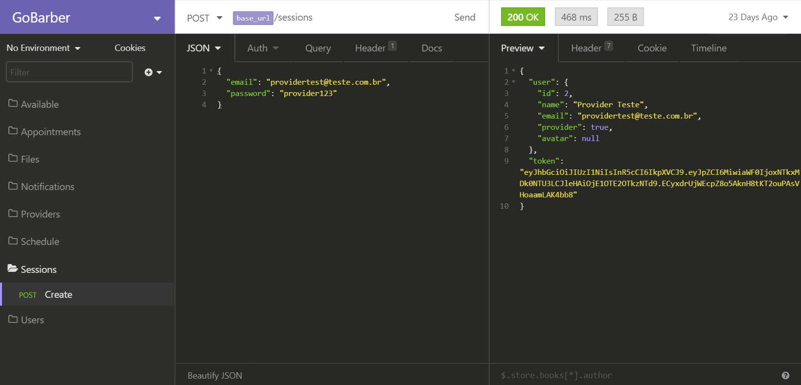

<h1 align="center">

</h1>

<h3 align="center">
  O projeto desenvolvido foi uma aplicação completa para uma prestadora de serviços de beleza fictícia, a GoBarber.
</h3>

<p align="center">
  <a href="#heavy_check_mark-configurações-necessárias">Configurações necessárias</>&nbsp;&nbsp;&nbsp;|&nbsp;&nbsp;&nbsp;
  <a href="#arrow_down_small-clonando-o-repositório">Clonando o repositório</a>&nbsp;&nbsp;&nbsp;|&nbsp;&nbsp;&nbsp;
  <a href="#beginner-iniciando-o-backend">Iniciando o backend</a>&nbsp;&nbsp;&nbsp;|&nbsp;&nbsp;&nbsp;
  <a href="#wrench-tecnologias--ferramentas--recursos">Tecnologias | Ferramentas | Recursos</a>&nbsp;&nbsp;&nbsp;|&nbsp;&nbsp;&nbsp;
  <a href="##memo-license">Licença</a>
</p>

Durante as aulas do [RocketSeat GoStack Bootcamp](https://rocketseat.com.br/bootcamp) além da teoria e para melhor aprendizado é desenvolvida uma aplicação completa (Back-end, Front-end e Mobile) exemplificando como são usados os conteúdos aprendidos e para treinar e consolidar o que foi ensinado fiz o clone code do app aplicando algumas estilização diferentes da proposta do projeto original.

<p align="center">
  
</p>

<blockquote align="center">“Acredite em você a cada passo”</blockquote>

### :heavy_check_mark: Configurações necessárias

-  [Git](https://git-scm.com)
-  [Node](https://nodejs.org/)
-  [Yarn](https://yarnpkg.com/)
-  [Docker](https://www.docker.com/docker-community)

### :arrow_down_small: Clonando o repositório
1. Pelo terminal, acesse o diretório em que deseja ter o repositório clonado e execute o comando a seguir.
```bash
# clonando o repositório
git clone https://github.com/belapferreira/gobarber
```

### :beginner: Iniciando o backend
1. Crie os serviços de bancos de dados `postgres`, `mongo` e `redis` utilizando os comandos a seguir. Os nomes e a senha são uma sugestão e podem ser alterados conforme sua preferência.
```bash
# criando serviço de banco de dados postgres
docker run --name postgressgobarber -e POSTGRES_PASSWORD=gobarber2020 -p 5432:5432 -d postgres

# criando serviço de banco de dados mongo
docker run --name mongobarber -p 27017:27017 -d -t mongo

# criando serviço de banco de dados redis
docker run --name redisbarber -p 6379:6379 -d -t redis:alpine
```
2. Utilizando uma aba do terminal inicie os serviços de banco de dados conforme comando abaixo.
```bash
# iniciando os serviços de banco de dados
docker start postgresgobarber mongobarber redisbarber
```
3. Abra o projeto no editor de sua preferência e renomeie o arquivo `.env.example` para `.env`.
4. Coloque as suas credenciais no arquivo `.env`.
5. Pelo terminal, acesse o diretório backend do repositório clonado e execute os seguintes comandos separadamente.
```bash
# instalando as dependências
yarn install

# executando as migrations
yarn sequelize db:migrate

# iniciando o servidor
yarn dev
```
### :wrench: Tecnologias | Ferramentas | Recursos

Esse projeto foi desenvolvido utilizando os seguintes recursos:

Geral

-  [ESLint](https://eslint.org/)
-  [Prettier](https://prettier.io/)
-  [Visual Studio Code](https://code.visualstudio.com/)

Backend

-  [Bcrypt](https://www.npmjs.com/package/bcrypt)
-  [Bee Queue](https://www.npmjs.com/package/bcrypt)
-  [Cors](https://github.com/expressjs/cors)
-  [Docker](https://www.docker.com/docker-community)
-  [date-fns](https://date-fns.org/)
-  [DotEnv](https://www.npmjs.com/package/dotenv)
-  [Express](https://expressjs.com/)
-  [Express-Async-Errors](https://github.com/davidbanham/express-async-errors)
-  [Express-Handlebars](https://github.com/ericf/express-handlebars)
-  [Insomnia](https://insomnia.rest/)
-  [JWT](https://jwt.io/)
-  [Jsonwebtoken](https://www.npmjs.com/package/jsonwebtoken)
-  [Mailtrap](https://mailtrap.io/)
-  [MongoDB](https://www.mongodb.com/)
-  [Mongoose](https://mongoosejs.com/)
-  [Multer](https://github.com/expressjs/multer)
-  [Node.js](https://nodejs.org/en/)
-  [node-postgres](https://www.npmjs.com/package/pg)
-  [Nodemailer](https://nodemailer.com/about/)
-  [Nodemailer-Express-Handlebars](https://www.npmjs.com/package/nodemailer-express-handlebars)
-  [nodemon](https://nodemon.io/)
-  [Pg](https://www.npmjs.com/package/pg)
-  [Pg-Hstore](https://www.npmjs.com/package/pg-hstore)
-  [PostgreSQL](https://www.postgresql.org/)
-  [Redis](https://redis.io/)
-  [Sentry](https://sentry.io/)
-  [Sequelize](http://docs.sequelizejs.com/)
-  [Sucrase](https://github.com/alangpierce/sucrase)
-  [Youch](https://www.npmjs.com/package/youch)
-  [Yup](https://www.npmjs.com/package/yup)

### :memo: License
Esse projeto está sob MIT license. Veja [LICENSE](https://github.com/belapferreira/gobarber/blob/master/LICENSE) para mais informações.

---

Feito por Bela Ferreira :blue_heart: Contato: https://www.linkedin.com/in/belapferreira :blush:
