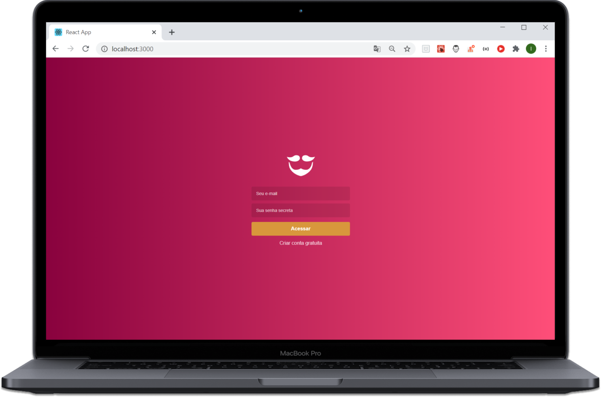
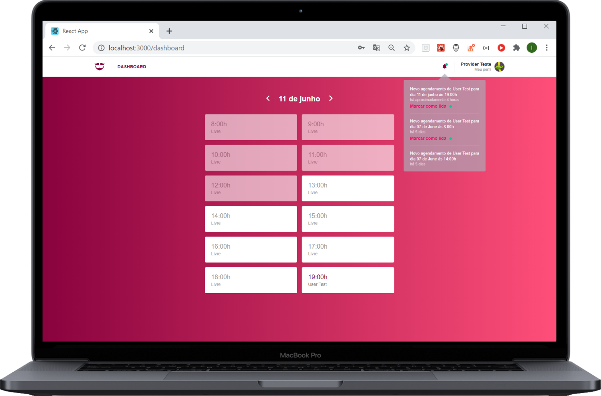

<h1 align="center">

</h1>

<h3 align="center">
  O projeto desenvolvido foi uma aplicação completa para uma prestadora de serviços de beleza fictícia, a GoBarber.
</h3>

<p align="center">
  <a href="#funcionalidades">Funcionalidades</a>&nbsp;&nbsp;&nbsp;|&nbsp;&nbsp;&nbsp;
  <a href="#heavy_check_mark-configurações-necessárias">Configurações necessárias</a>&nbsp;&nbsp;&nbsp;|&nbsp;&nbsp;&nbsp;
  <a href="#arrow_down_small-clonando-o-repositório">Clonando o repositório</a>&nbsp;&nbsp;&nbsp;|&nbsp;&nbsp;&nbsp;
  <a href="#computer-iniciando-o-frontend">Iniciando o frontend</a>&nbsp;&nbsp;&nbsp;|&nbsp;&nbsp;&nbsp;
  <a href="#wrench-tecnologias--ferramentas--recursos">Tecnologias | Ferramentas | Recursos</a>&nbsp;&nbsp;&nbsp;|&nbsp;&nbsp;&nbsp;
  <a href="#memo-license">Licença</a>
</p>

Durante as aulas do [RocketSeat GoStack Bootcamp](https://rocketseat.com.br/bootcamp) além da teoria e para melhor aprendizado é desenvolvida uma aplicação completa (Back-end, Front-end e Mobile) exemplificando como são usados os conteúdos aprendidos e para treinar e consolidar o que foi ensinado fiz o clone code do app aplicando algumas estilização diferentes da proposta do projeto original.

  <p align="center">
    
    
  </p>

  ### Funcionalidades

  - Login na aplicação para os prestadores de serviço;
  - Cadastro de prestadores de serviço;
  - Painel para visualização dos agendamentos por dia;
  - Recebimento de notificações quando ocorre um agendamento;
  - Marcação de notificação como lida;
  - Tela para atualização de dados, senha e foto do prestador de serviço logado.

<blockquote align="center">“Acredite em você a cada passo”</blockquote>

### :heavy_check_mark: Configurações necessárias

-  [Git](https://git-scm.com)
-  [Node](https://nodejs.org/)
-  [Yarn](https://yarnpkg.com/)
-  [Docker](https://www.docker.com/docker-community)

### :arrow_down_small: Clonando o repositório
1. Pelo terminal, acesse o diretório em que deseja ter o repositório clonado e execute o comando a seguir.
```bash
# clonando o repositório
git clone https://github.com/belapferreira/gobarber
```
### :computer: Iniciando o frontend
######Observação: é necessário que o backend tenha sido iniciado antes.
1. Pelo terminal, acesse o diretório fronted do repositório clonado e execute os seguintes comandos separadamente.
```bash
# instalando as dependências
yarn install

# iniciando a aplicação
yarn start
```
### :wrench: Tecnologias | Ferramentas | Recursos

Esse projeto foi desenvolvido utilizando os seguintes recursos:

Geral

-  [ESLint](https://eslint.org/)
-  [Prettier](https://prettier.io/)
-  [Visual Studio Code](https://code.visualstudio.com/)

Frontend

-  [@rocketseat/unform](https://github.com/Rocketseat/unform)
-  [@testing-library/jest-dom](https://github.com/testing-library/jest-dom)
-  [@testing-library/react](https://github.com/testing-library/react-testing-library)
-  [@testing-library/user-event](https://github.com/testing-library/user-event)
-  [axios](https://www.npmjs.com/package/axios)
-  [babel-eslint](https://github.com/babel/babel-eslint)
-  [babel-plugin-root-import](https://www.npmjs.com/package/babel-plugin-root-import)
-  [customize-cra](https://github.com/arackaf/customize-cra)
-  [date-fns](https://date-fns.org/)
-  [date-fns-tz](https://www.npmjs.com/package/date-fns-tz)
-  [history](https://github.com/ReactTraining/history)
-  [immer](https://github.com/immerjs/immer)
-  [polished](https://polished.js.org/)
-  [prop-types](https://www.npmjs.com/package/prop-types)
-  [react](https://pt-br.reactjs.org/)
-  [react-app-rewired](https://www.npmjs.com/package/react-app-rewired)
-  [react-dom](https://www.npmjs.com/package/react-dom)
-  [react-icons](https://react-icons.github.io/react-icons/)
-  [react-perfect-scrollbar](https://github.com/goldenyz/react-perfect-scrollbar)
-  [react-redux](https://redux.js.org/basics/usage-with-react)
-  [react-router-dom](https://reacttraining.com/react-router/web/guides/quick-start)
-  [react-scripts](https://www.npmjs.com/package/react-scripts)
-  [react-toastify](https://github.com/fkhadra/react-toastify)
-  [reactotron-react-js](https://github.com/infinitered/reactotron)
-  [reactotron-redux](https://github.com/infinitered/reactotron/blob/master/docs/plugin-redux.md)
-  [reactotron-redux-saga](https://github.com/infinitered/reactotron/blob/master/docs/plugin-redux-saga.md)
-  [redux](https://redux.js.org/)
-  [redux-persist](https://github.com/rt2zz/redux-persist)
-  [redux-saga](https://redux-saga.js.org/)
-  [styled-components](https://styled-components.com/)

### :memo: License
Esse projeto está sob MIT license. Veja [LICENSE](https://github.com/belapferreira/gobarber/blob/master/LICENSE) para mais informações.

---

Feito por Bela Ferreira :blue_heart: Contato: https://www.linkedin.com/in/belapferreira :blush:
